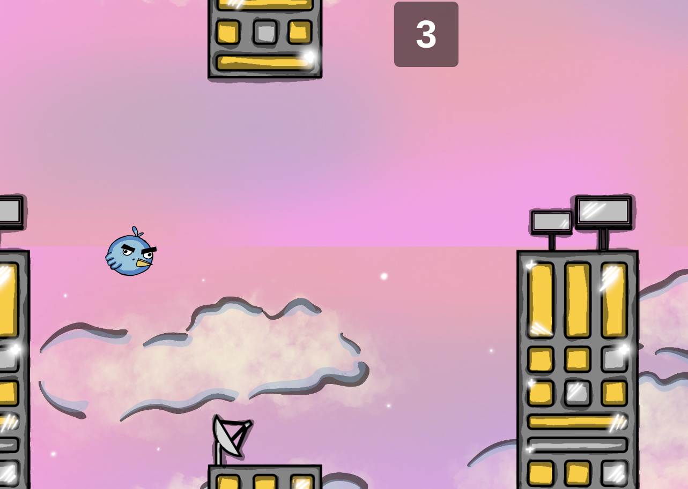

# Go Pigeon

Go Pigeon is a simple yet challenging arcade game where players control a small bird, guiding it through narrow gaps between buildings. The bird flaps its wings with each tap, requiring precise timing to avoid obstacles and stay airborne. The goal is to survive as long as possible while scoring points for each building successfully passed. With its retro pixel-art style and addictive gameplay, Go Pigeon tests players’ reflexes and patience in a fun and frustrating way!

## 🎮 How to Play

1. **Start the Game** – Open the game in your browser (gopigeon.jeremycasanova.me). The pigeon will be stationary, until you click start game.
2. **Flap to Fly** – Tap the screen, click, or press the spacebar to make the pigeon flap its wings and rise.
3. **Avoid Obstacles** – Navigate through the gaps between buildings by timing your flaps carefully. If the pigeon hits a building or the ground, the game is over.
4. **Score Points** – Earn points for each building successfully passed. Try to beat your high score!
5. **Keep Going!** – The game continues until the pigeon crashes. Restart and try again to improve your score.

## 🚀 Installation & Setup

1. Clone this repository:
   ```sh
   git clone git@github.com:Jcasanova1990/GoPigeon.git

2. Navigate to the project folder:
cd GoPigeon

3. Install dependencies:
npm i

4.Build the project:
npx vite build

5. Start the development server:
npm run dev

# 🛠 Technologies Used
HTML5 Canvas
CSS3
JavaScript
Vite

# 📸 Screenshots


📜 License
This project is open-source and available under the MIT License.